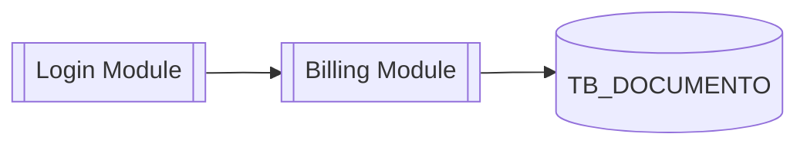

# cad-doc-views — Views (12) (substrato neutro)

## Objetivo

Reunir as **representações gráficas** do sistema (`12 Views`): responde *"como podemos
visualizar este conhecimento?"*. Uma mesma informação pode ter **diversas visões** (uma de
arquitetura, uma de dados, uma de sequência). Views **derivam** de notas de Knowledge já
evidenciadas — não introduzem fatos novos; consolidam visualmente o que já existe.

Segue as [convenções do vault](../cad-doc-conventions/SKILL.md).

## Entradas

- Notas de Knowledge (01–08) já criadas e suas evidências (`09 Evidence`).
- Fontes com diagramas prontos escaneadas por `/cad:discovery` (reproduzidos como
  Mermaid/PlantUML, com a evidência ligada).

## Template de nota de view

```markdown
---
title: View - Arquitetura de Componentes
aliases: [Diagrama de Componentes]
tags: [view, arquitetura]
type: view
status: confirmed
source: "[[EV-041]]"
author: CAD Discovery
created: 2026-07-10
---

# View · Arquitetura de Componentes



## Notas representadas
- [[Login Module]], [[Billing Module]], [[TB_DOCUMENTO]]

## Outras visões do mesmo tema
- [[View - Fluxo de Emissão]]
```

## Como preencher

- **Prefira Mermaid** (renderiza no Obsidian e no GitHub); use PlantUML quando o diagrama
  exigir (ex.: diagramas de sequência complexos).
- **Toda View liga às notas que representa** (`[[...]]`) e traz `source:` apontando à
  evidência de origem quando o diagrama reproduz algo da fonte. View puramente derivada de
  notas já evidenciadas pode citar as próprias notas como origem.
- **Não introduza fatos novos numa View.** Se ao diagramar você descobrir algo sem nota,
  crie a nota de Knowledge (com evidência) **antes**, ou abra `11 Investigations`.
- **Vocabulário proibido:** diagramas neutros; nada de notação amarrada a uma técnica
  (ex.: não rotule caixas como "agregado" ou "bounded context").
