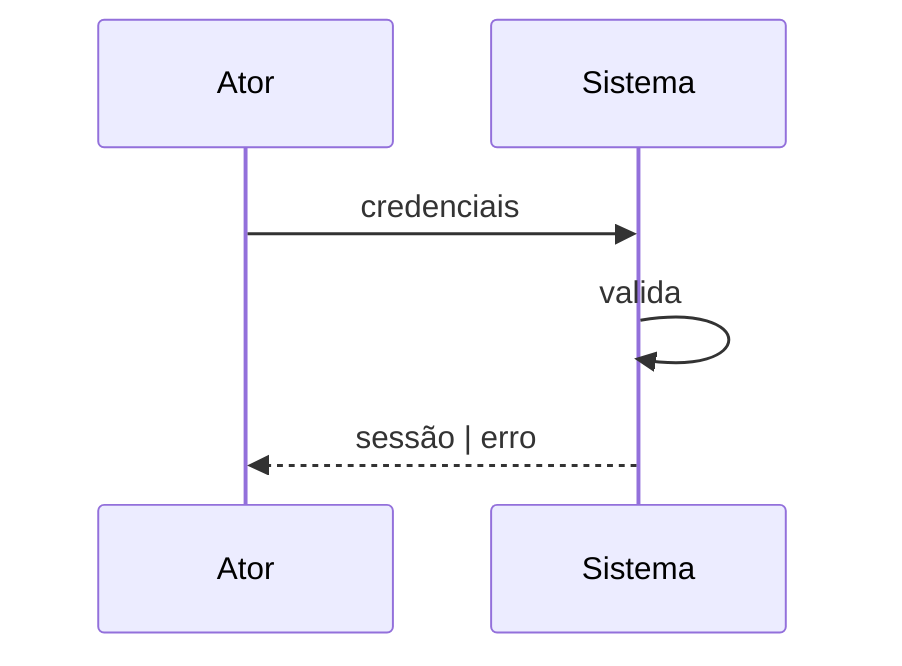

# knowledge-vault-doc-system — Structural & Behavioral Knowledge (03–04)

## Objetivo

Produzir as notas que respondem **"do que o sistema é composto?"** (`03 Structural
Knowledge`) e **"como funciona?"** (`04 Behavioral Knowledge`) — o que **existe** e como se
**comporta**, em nível conceitual/lógico e **neutro** (sem assumir tecnologia nem método).

Segue as [convenções do vault](../knowledge-vault-doc-conventions/SKILL.md).

## Entradas

- Fontes escaneadas por `/cad:discovery`.
- Notas de `09 Evidence` (para ligar via `source:`).
- Detalhe técnico fino (tipos, tabelas, FKs) **não** entra aqui — vai para `05 Source Code`
  e `06 Data` (skill `knowledge-vault-doc-technical`). Aqui fica o **conceito** e o **comportamento**.

## Pastas e notas

- **`03 Structural Knowledge/`** — uma nota por: conceito (`Cliente.md`, `Documento.md`),
  componente, módulo (`Módulo Financeiro.md`), serviço, interface, pacote/biblioteca,
  estrutura importante (`Fila de Processamento.md`) e **relacionamentos** entre eles.
- **`04 Behavioral Knowledge/`** — uma nota por: fluxo (`Fluxo - Login.md`), caso de uso,
  processamento/algoritmo (`Algoritmo - Cálculo de Juros.md`), máquina de estado, job de
  batch (`Processo - Fechamento Diário.md`), sequência de execução.

## Template de nota

### Estrutural — conceito/entidade (03)

```markdown
---
title: Cliente
aliases: [Customer]
tags: [conceito, dominio/cadastro]
type: concept
status: confirmed
source: "[[EV-5-a1-003 · Cliente é cadastrado antes de operar|EV-5-a1-003]]"
author: CAD Discovery
created: 2026-07-10
---

# Cliente

Pessoa física ou jurídica que possui relação com o sistema.

## Atributos (conceituais)
- Identificação, nome, situação cadastral.

## Relacionamentos
- [[Cliente]] é persistido em [[TB_CLIENTE]]
- [[Cliente]] participa de [[Emissão de Documento]]
- Multiplicidade: um [[Cliente]] possui `0..n` [[Documento]]
```

### Comportamental — fluxo/algoritmo (04)

```markdown
---
title: Fluxo - Login
tags: [fluxo, autenticacao]
type: flow
status: confirmed
source: "[[EV-5-a3-004 · Fluxo de login valida credenciais|EV-5-a3-004]]"
author: CAD Discovery
created: 2026-07-10
---

# Fluxo - Login



## Passos
1. …

## Relacionado
- Realiza [[Autenticação]] · ver diagrama completo em [[View - Autenticação]]
```

## Como preencher

- **Neutralidade estrutural:** "o sistema tem os conceitos X, Y" é descritivo (cabe aqui);
  dizer que X é um *agregado* ou *objeto de valor* é opinião de método (**não** entra).
- **Relacionamentos com multiplicidade** (`1..1`, `1..n`, `0..n`) quando a fonte sustentar.
- Diagramas curtos podem ficar inline (Mermaid); diagramas substanciais vão em `12 Views`
  (skill `knowledge-vault-doc-views`) e são referenciados por `[[...]]`.
- Toda nota confirmada/inferida traz `source:` → `09 Evidence`. Sem evidência, abra
  `11 Investigations`. Conflito entre fontes → versão priorizada pela hierarquia +
  investigação.
- **Vocabulário proibido:** nenhum termo de técnica (agregado, bounded context, evento de
  domínio no sentido DDD/ES, MVP, persona…).
